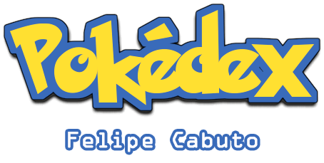
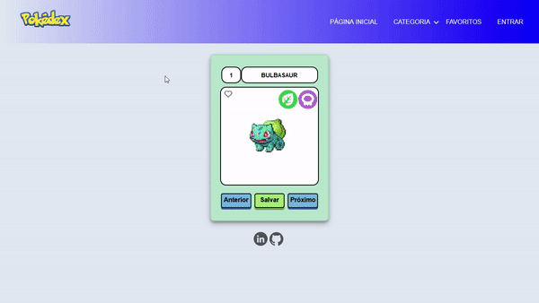

<h1 align="center">
  
</h1>

<h1 align="center">
  
</h1>

<h3 align="center">
    <a href="https://felipecabuto.github.io/pokedex/">Acessar a demonstração</a>
<h3 >

## 🚀 Utilizando javascript, desenvolva uma aplicação web que liste e detalhe todos os pokémons catalogados (criar uma Pokédex)

<h4 align="center"> 
	🚧 Em construção... 🚧
</h4>

### 📝 Objetivo

- [x] Desenvolva uma aplicação web que liste e detalhe todos os pokémons catalogados
- [x] Utilizar ícones do Font Awesome
- [x] Obtenha os dados através do link realizando uma requisição (JSON)
- [x] Crie uma lista com os pokémons existentes (Imagem; Nome; Registro nacional; Tipos)
- [x] Quando clicado, marcará o pokémon como favorito
- [x] Crie um input que irá filtrar a lista por nome ou registro nacional
- [x] Crie uma lista de botões com os tipos que atuarão como filtro
- [ ] Permitir um filtro que irá listar somente os pokémons favoritos
- [ ] Crie um select que atuará como ordenação da lista com os valores ascendente e descendente (Nome; Registro Nacional)
- [x] Crie o header da aplicação, apenas visual sem funcionalidades
- [x] Crie a página de login (extra)

### 📦 Pré-requisitos

- Antes de começar, você precisa ter instalado em seu dispositivo as seguintes ferramentas:
[Git](https://git-scm.com), [Node.js](https://nodejs.org/en/)
- Instale o XAMPP para criar um servidor local e ter acesso a visualização do código através do browser
- A pasta do projeto deverá estar na pasta htdocs do XAMPP
- Dê Start no Apache e copie o endereço no browser (exemplo: https://localhost/pokedex)
- Para ter acesso ao código recomendo o editor [VSCode](https://code.visualstudio.com/)

### 🛠 Tecnologias

As seguintes ferramentas foram usadas na construção do projeto:

	
## 🤝 Contribuindo

As contribuições são o que tornam a comunidade open source um lugar incrível para aprender, inspirar e criar. Quaisquer contribuições que você fizer são **muito bem-vindas**.

Se você tiver alguma sugestão de melhoria para este código, sinta-se a vontade para fazer um fork do repositório e criar um pull request. Você também pode simplesmente abrir uma issue com a tag "enhancement".

1. Faça o Fork do Projeto
2. Crie sua Branch (`git checkout -b <nome da branch>`)
3. Confirme as alterações (`git commit -m 'adicionar alteração'`)
4. Envie para a Branch (`git push origin main`)
5. Faça o Pull Request (`git pull`)

### Autor
---

<a href="https://www.linkedin.com/in/felipecabuto/">
 
  
 <b>Felipe Cabuto</b></a> 
##  
